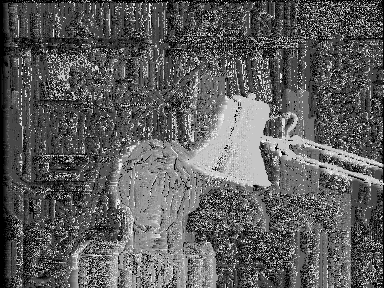
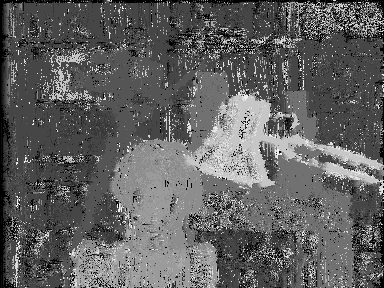
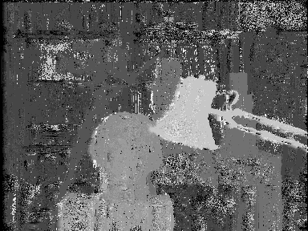
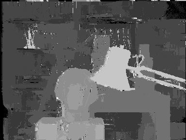
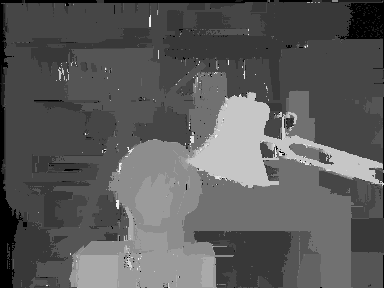
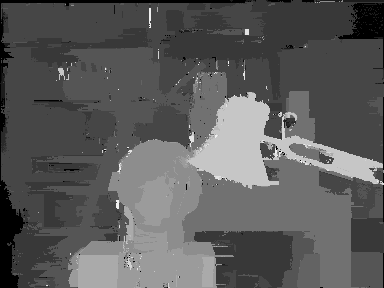

AD
==

Census
======

ADCensus
========

	ad_lambda = 10
	census_lambda = 30

Cross-based cost aggregation
============================

	4 iterations
	L1 = 34
	L2 = 17
	tau1 = 20
	tau2 = 6

  
  
  
  
